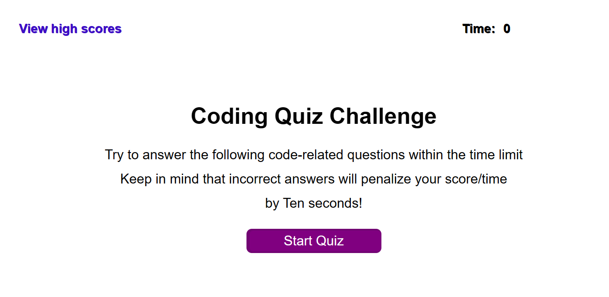

# MAUGB-M4C-Coding-Assessment-API-Timed-Coding-Quiz
Timed Coding Quiz with multiple choices

## Description

This Project was created using HTML, JavaScript and CSS.
The objective was to create an interactive Quiz with coding related questions.
This program combines multiple pages interacting with the user.
Questions are presented as multiple options and it is friendly user.
Quiz is being timed and it is a multiple option answer, every time that there is an incorrect answer.
the time is penalized.

The strategy of this project was creating an array of questions and hide and unhide the sections to move to the next questions.

At the end the user gets the score and must enter the name, so it is recorded on the application.

There is an option to see the previous high scores of the participants.

## Table of Contents (Optional)

- [Installation](#installation)
- [Usage](#usage)
- [Credits](#credits)
- [License](#license)

## Installation

Timed coding quiz application is a Web browser application; it can run in google chrome, Firefox,
explore, 
There is no need to special installation this is an intuitive application that will guide the user to the quiz sections.
The application can be found using the following links:

Link to GitHub Depository location:  
https://github.com/MauricioGB1/MAUGB-M4C-Coding-Assessment-API-Timed-Coding-Quiz

Deployed Link for live application: 
https://mauriciogb1.github.io/MAUGB-M4C-Coding-Assessment-API-Timed-Coding-Quiz/

## Usage

Provide instructions and examples for use. Include screenshots as needed.

To add a screenshot, create an `assets/images` folder in your repository and upload your screenshot to it. Then, using the relative file path, add it to your README using the following syntax:

## Credits

Special Thank you to the support team from RICE University Coding Bootcamp.

## License

This application has been created and running under MIT license.

## Features

Coding Quiz application has the following features:
- Multiple options selections
- Timer
- Score
- Penalization of time
- immediate results for each question correct or incorrect.
- score storage
- Name storage for each score
- List of highest scores
- adjustable to multiple screen sizes

## Tests

Testing of timer counting
- Testing or array function and interaction
