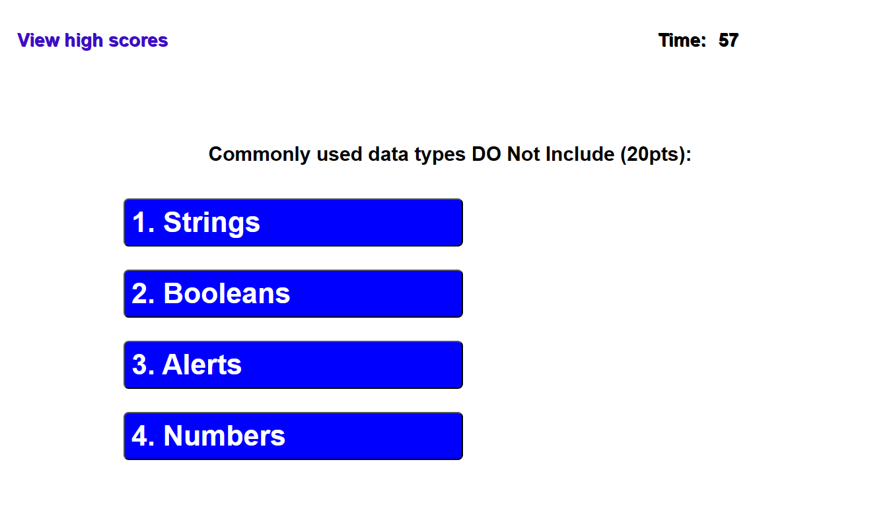
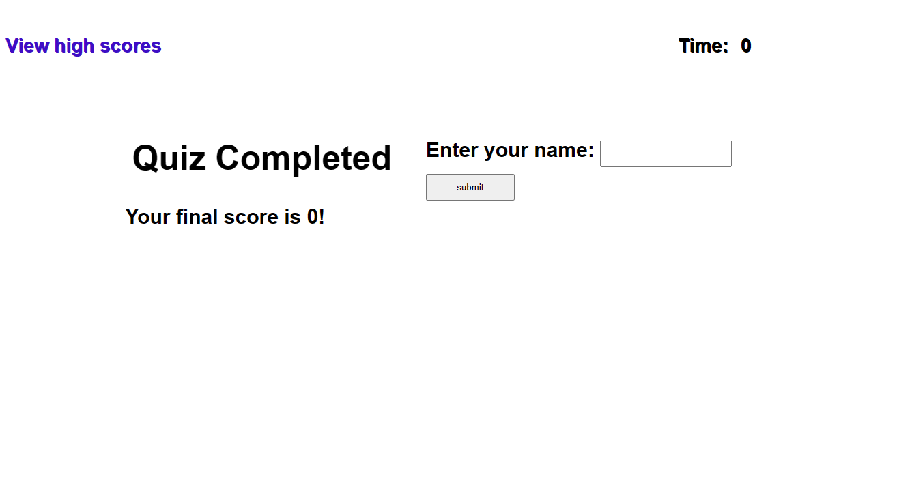
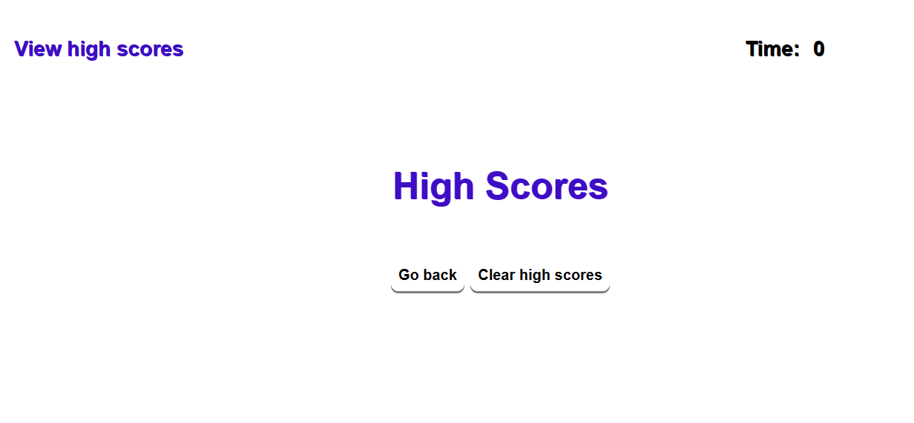

# MAUGB-M4C-Coding-Assessment-API-Timed-Coding-Quiz
Timed Coding Quiz with multiple choices

## Description

This Project was created using HTML, JavaScript and CSS code.
The objective was to create an interactive Quiz with coding related questions; This program combines multiple pages interacting with the user in an ituitive way. Questions are presented as multiple-choice options and it is friendly to get the answer from the user.
Quiz is being timed and it is a multiple option answer, every time that there is an incorrect answer.
The time is penalized with a deduction of ten seconds.

The strategy of this project was to create an array of questions and hide and unhide the sections to move to the next questions.
We are using an iteration to present each of the questions. Applications uses DOM , using the document getElementbyID Function, EvventListener to trigger a function.
At the end of the quiz the user gets the score and must enter the name, so it is recorded locally by the application.
Previous scores that have been recorded are available for the user, which has an n option to see the previous high scores of the participants.

Also high scores can be deleted and start the quiz again.

## Table of Contents (Optional)

- [Installation](#installation)
- [Usage](#usage)
- [Credits](#credits)
- [License](#license)
- [Features] (##features)
- [Tests] (##tests)

## Installation

Timed coding quiz application is a Web browser application; it can run in google chrome, Firefox,
explore browsers. 
There is no need for special installation this is an intuitive application that will guide the user to the quiz sections.
The application can be found using the following links:

Link to GitHub Depository location:  
https://github.com/MauricioGB1/MAUGB-M4C-Coding-Assessment-API-Timed-Coding-Quiz

Deployed Link for live application: 
https://mauriciogb1.github.io/MAUGB-M4C-Coding-Assessment-API-Timed-Coding-Quiz/

## Usage

The application asks the user with a main page if wish to start with the Quiz. Then a start quiz button shows how to start the timed quiz.
After clicking the button, the program presents the questions related to coding displayed as multiple options; 60 second timer start the countdown. After each response user will get immediate feedback if the answer was correct or incorrect. For cases which answers an incorrect, then the program will reduce by ten seconds the time remaining.
The user can continue selecting the answers for each question, once user finishes with the questions the score is indicated with a prompt asking for the nambe.
If the timer reaches 0 seconds, then the application finishes and ask teh user to enter their name to record the score and ranking with previous scores.

User also has the option to select the high scores to see previous history of scores and / or delete scores if he wish.

Local storage for scores sorted by highest ranking.

To add a screenshot, create an `assets/images` folder in your repository and upload your screenshot to it. Then, using the relative file path, add it to your README using the following syntax:

## Credits

Special Thank you to the support team from RICE University Coding Bootcamp.

## License

This application has been created and running under MIT license.

## Features

Coding Quiz application has the following features:
- Multiple options selections
- Timer
- Score
- Penalization of time
- Immediate results for each question correct or incorrect.
- Score storage
- Name storage for each score
- List of highest scores
- Adjustable to multiple screen sizes

## Tests

Testing of timer counting
- Testing or array function and interaction
